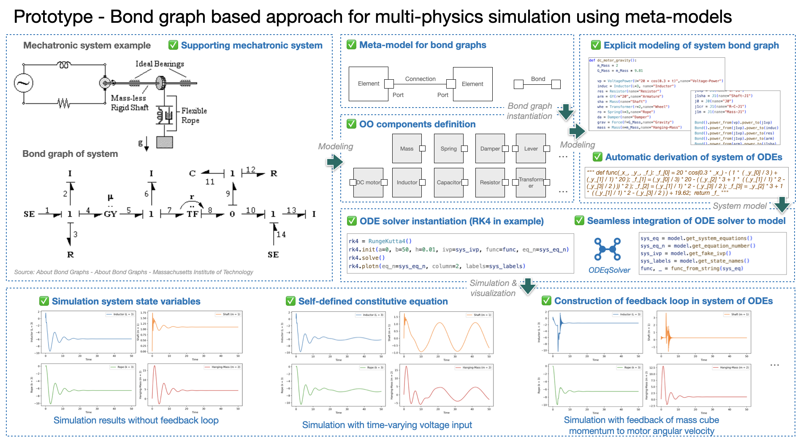

I gained my bachelor degree in mechanical engineering in 2010 and my first M.Sc. degree in mechanical engineering with specialization of logistics, in Tongji-University in 2013. I work as junior project manager in pilot hall at SAIC Volkswagen between 2013 and 2015.  Since 2015, I have been studying technology management in University of Stuttgart and gained my second M.Sc. degree. From 2019 to 2022, I worked as researcher in  IAT of University of Stuttgart together in the team Digital Engineering at Fraunhofer IAO.

---

# Research

Research interests are Modeling and Simulation, Model-based Systems Engineering, AI for Science, Machine Learning, Natural Language Processing, etc.

### - ModelSolver (2022)

*ModelSolver* is a hobby project due to personal interests. It solves system of ODEs derived from bond graph. The main goal is to learn and explore the interdisciplinary simulation (or multi-physics simulation) towards MBSE approach.

Both mechanical system modeling, bond graph transformation and numerical solver (e.g. RK-Fehlberg order4/order5) are developed with Python as test ground for the purpose of a PoC. Further development and realization could be conducted with Python and C++ mixed.

### - ODEqSolver (2022)

*ODEqSolver* is a hobby project due to personal interests. It solves system of ODEs described in a list of string in Python. The main goal is to have a insight in the backbone of simulation technology. Deepdived are methods of explicit and implicit solver, rootfinding and linear system. Simple demos are realizable with Python/Rust. Further research towards its application in established models, and PDE solver.

### - QU4LITY Project (2020-2022)

*Qu4lity*  (EU H2020 825030) is the biggest European project dedicated to Autonomous Qu4lity (AQ) and Zero Defect Manufacturing (ZDM) in the Industry 4.0, co-funded by the Horizon 2020. The pilot project with Airbus origins from the concept of semantic integration in industrial system design.

Our pilot is based on a case from Airbus. Research concept is a semantic integration in industrial system design towards MBSE approach. The aim of the reasearch is to integrate different engineering activities, processes, methods, tools in system desing so that people from different domains/departments can colaborate efficiently and cross-disciplinary decision making are better supported (pic. Below trade dashboard).  

The DES tool is developed with Python based on open source discrete event simulation engine *SimPy*. DES models are object-oriented designed. Models are instantiated according to design concept models as input, then processed and simulated, aiming at a automatic  generation of design concepts trade-off to support decision (pic. below data flow overview).

**Video Link**: [Youtube - Industrial Co-Design at Airbus - Results from EU project QU4LITY](https://www.youtube.com/watch?v=kl_Kg-8DOSA)

### - AI feasibility in Offer Analysis (2021)

Mainly NLP projects.

Document classification with the help of text and images.

Document search.

---

# Pubulications


  You can also find my articles on <u><a href="{{author.googlescholar}}">my Google Scholar profile</a>.</u>





  


---

# Miscellaneous

### - Master thesis

Development of a method for company-specific advancement of digital engineering based on AI-functionalities at the example of a voice-controlled 3D-CAD application

### - Student research project

Study of the influences of Industry 4.0 on product development

