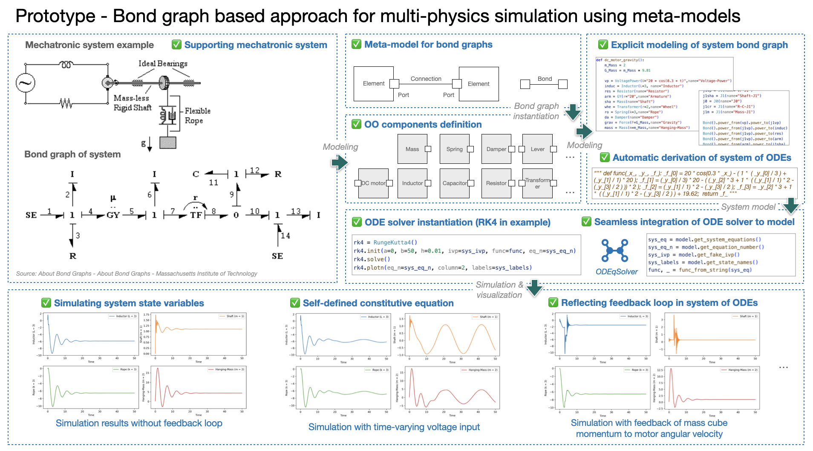
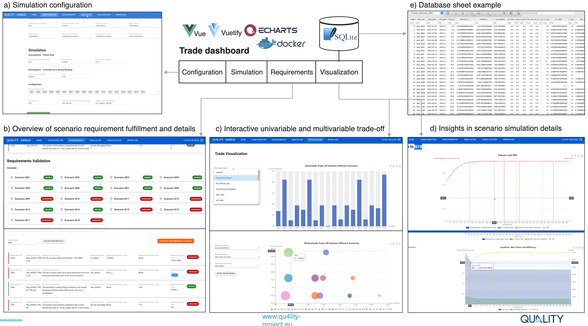
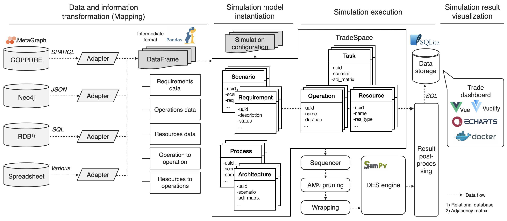
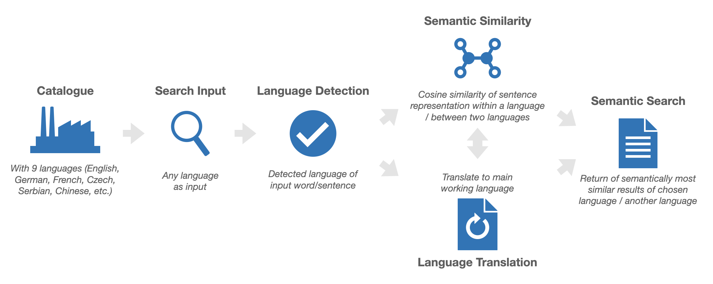

I gained my bachelor degree in mechanical engineering in 2010 and my first M.Sc. degree in mechanical engineering with specialization of logistics, in Tongji-University in 2013. I worked as junior project manager in pilot hall at SAIC Volkswagen between 2013 and 2015.  Since 2015, I have been studying technology management in University of Stuttgart and gained my second M.Sc. degree. From 2019 to 2022, I worked as researcher in  IAT of University of Stuttgart and in the team Digital Engineering at Fraunhofer IAO.

---

# Research

Research interests are Modeling and Simulation, Model-based Systems Engineering, Digital Twin, CPS, AI for Science, Machine Learning, Natural Language Processing, etc.

### - *ModelSolver (2022)*

ModelSolver is a <u>personal project</u> due to personal interests. It can model multiphysics system from bond graph and solves system of ODEs derived from the graph. The main goal to to explore the meta-model approach for system-level simulation towards MBSE approach.

Both modeling, bond graph processing and numerical solvers (e.g. RK-Fehlberg order4/order5) are developed with Python as test ground for the purpose of a PoC. Further development and realization could be conducted with Python and C++ mixed.

### - *ODEqSolver (2022)*

*ODEqSolver* is a <u>personal project</u> due to personal interests. It solves system of ODEs described in a list of equation strings in Python. The main goal is to gain a insight in the backbone of simulation technology. Deepdived are methods of explicit and implicit solver, rootfinding and linear system. Simple demos are realizable with Python/Rust. Further research towards its application in established models, and PDE solver.

### - *QU4LITY Project Airbus Pilot (2020-2022)*

Qu4lity  (EU H2020 825030) is the biggest European project dedicated to Autonomous Qu4lity (AQ) and Zero Defect Manufacturing (ZDM) in the Industry 4.0, co-funded by the Horizon 2020.

This is a <u>public funded project</u>. The pilot is based on a case from Airbus. Research concept is a semantic integration in industrial system design towards MBSE approach. The aim of the reasearch is to integrate different engineering activities, processes, methods, tools in system design so that people from different domains/departments can colaborate efficiently and cross-disciplinary decision making are better supported (pic. below trade dashboard).  

The DES tool is developed with Python based on an open source discrete event simulation engine *SimPy*. DES models are object-oriented designed. Models are instantiated according to design concept models in meta-model, then processed and simulated, aiming at a automatic  generation of design concepts trade-off to support decision (pic. below data flow overview).

**Video Link**: [Youtube - Industrial Co-Design at Airbus - Results from EU project QU4LITY](https://www.youtube.com/watch?v=kl_Kg-8DOSA)

### - *QU4LITY Project Continental Pilot (2021)*

This is a <u>public funded project</u>. The pilot is based on a case from Continental. A catalogue that records the failure types from SMT manufacturing line has different languages for world-wide factories. Misplacement or errors could occur by confusion of unexperienced people or misunderstanding due to cross-lingual semantic difference. A small PoC of semantic search aims to verify the feasibility of using NLP technology to tackle the situation.

The processing pipeline is developed with Python and open source tools: language detection by SpaCy, translation and similarity representation by by MarianMT and RoBERTa supported by transformers from HuggingFace. Results were enlightening.

### - *AI for Document Analysis (2021)*

This is a <u>industry project</u>. There are experiments for document classification using different open source tools and methods to deal with txt formats, including Doc2Vec, FastText, TextCNN, BERT, RoBERTa, etc. Besides, OpenCV is used to deal the image of standard format document to determine the document class. BM25 search algorithm is used to find relevant information in documents.

---

# Pubulications


  You can also find my articles on <u><a href="{{author.googlescholar}}">my Google Scholar profile</a>.</u>





  


---

# Miscellaneous

Master thesis: Development of a method for company-specific advancement of digital engineering based on AI-functionalities at the example of a voice-controlled 3D-CAD application

Master student thesis: Study of the influences of Industry 4.0 on product development

