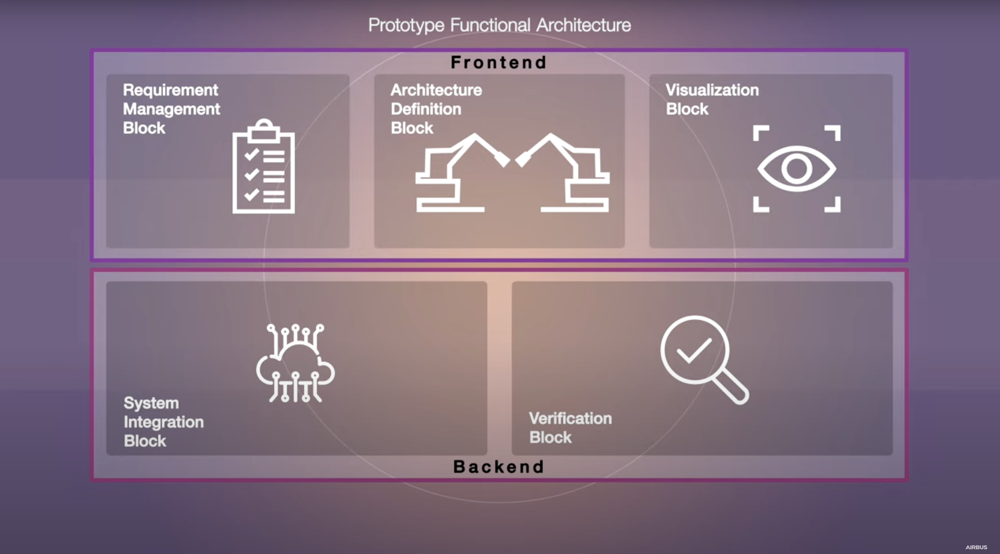

In 2013, I received my first M.Sc. degree in Mechanical Engineering from the Tongji-University (China). From 2013 to 2015, I worked as junior project manager in pilot hall at SAIC Volkswagen. After 2015, I studied Technology Management in University of Stuttgart and gained my second M.Sc. degree in 2019. Since then, I worked as researcher for Institute of Human Factors and Technology Management IAT in University of Stuttgart together in the team Digital Engineering at Fraunhofer IAO. In 2022, I returned to China and I would like to continue my research work...

## Research interests

- Model-based System Engineering
- Cyber physical system
- ...

## Research projects

**- ModelSolver Project (2022)**

***ModelSolver*** is a hobby project due to personal interests in numerical solver and modeling and simulation. The main goal is to learn and explore the interdisciplinary simulation (or multi-physics simulation) with MBSE approach.

Both mechanical system modeling, bond graph transformation and numerical solver (e.g. Runge-Kutta Fehlberg order4/order5) are implemented in Python as playground for purpose of reaching a proof of concept. Further development and realization could be conducted with Python and C++ mixed.

**- QU4LITY Project (2020-2022)**

***Qu4lity*** is the biggest European project dedicated to Autonomous Qu4lity (AQ) and Zero Defect Manufacturing (ZDM) in the Industry 4.0, co-funded by the Horizon 2020 (EU H2020 825030). The pilot project with Airbus origins from the concept of semantic integration in industrial system design using ontology, i.e. an MBSE approach realized via ontology (GOPPRRE).

The prototype is developed end-to-end. Tools involved are ***Protege*** for application ontology development, ***Metagraph and KARMA language*** for architecture definition and system integration, **DES** (discrete event simulation) **tool based on SimPy** for design verification, self-developed trade dashboard using ***Vue, Vuetify and Apache Echarts*** for integrated visualization as frontend, ***Neo4j server*** and local ***SQLite*** as database, ***docker*** for frond- and backend program containerization, ***Google Cloud Platform*** and ***Azure AWS*** for deployment, etc.

**Project link**: https://qu4lity-project.eu/

**Video Link**: [Youtube - Industrial Co-Design at Airbus - Results from EU project QU4LITY](https://www.youtube.com/watch?v=kl_Kg-8DOSA)

**- Ultra-efficient industrial areas (2021-2022)**

Demonstration for the realization of ultra-efficient industrial areas

Link: [**Ultra-efficient industrial areas**](https://www.engineering-produktion.iao.fraunhofer.de/de/forschung/ultraeffizienz4industriegebiete.html)

## Pubulication list


  You can also find my articles on <u><a href="{{author.googlescholar}}">my Google Scholar profile</a>.</u>





  


## My thesis

- Master thesis: Development of a method for company-specific advancement of digital engineering based on AI-functionalities at the example of a voice-controlled 3D-CAD application
- Student research project: Influences of Industry 4.0 on product development
- Master thesis: ...

# Publications

- Hu, X., Lu, J., Zheng, X., Arista, R., Sorvari, J., Lentes, J., Ubis, F. & Kiritsis, D. (2022).  Semantic Modeling Supporting Discrete Event Simulation for Aircraft Assembly Process. <i>International Symposium on Knowledge and Systems Sciences </i> (pp. 83-98). Springer, Singapore
- Hu, X., Arista, R., Lentes, J., Sorvari, J., Lu, Jinzhi, Zheng, X., Sorvari, J., Ubis, F. & Kiritsis, D. (2022). Ontology-centric industrial requirements validation for aircraft assembly system design. <i>IFAC-PapersOnLine</i>, in press
- Hu, X., Arista, R., Zheng, X., Lentes, J., Sorvari, J., Lu, J., Ubis, F. & Kiritsis, D. (2022). Ontology-based system to support industrial system design for aircraft assembly. <i>IFAC-PapersOnLine, 55(2)</i>, 175-180.
- Zheng, X., Lu, J., Arista, R., Hu, X., Lentes, J., Ubis, F., Sorvari, J. & Kiritsis, D. (2020). Development of an application ontology for knowledge management to support aircraft assembly system design. *CEUR Workshop Proceeding* ISSN, 1613, 0073.
- Fang, D. & Hu, X. (2014). Architecture of a Knowledge-Based Education System for Logistics. *In Frontier and Future Development of Information Technology in Medicine and Education* (pp. 2683-2692). Springer, Dordrecht.
- Zheng, X., Hu, X., Arista, R., Lu, J., Sorvari, J., Lentes, J., & Ubis, F. (2022). A semantic-driven tradespace framework to accelerate aircraft manufacturing system design. (unpublished)

